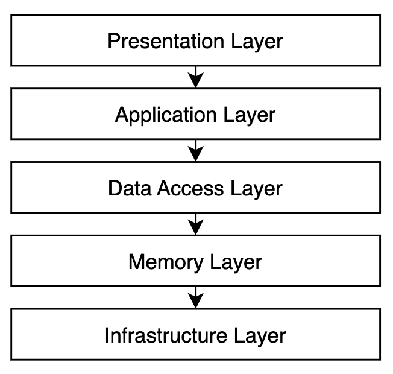

# graphics engine

## Memory Layer

Application consists of memory blocks sequence.

Each memory block consists of packets sequence.

All values are measured in bytes, where 1 byte is an unsigned 8-bit integer. Integers consisting of multiple bytes are always Little-Endian.

### RegistryMemoryBlock

Registry memory block is the main block which should be the first in the memory. Consists of 32-byte packets.

<table>
    <thead>
        <tr>
            <th>Syntax</th>
            <th>Bytes</th>
        </tr>
    </thead>
    <tbody>
        <tr>
            <td>
                <b>ZeroByteRegistryPacket</b>
            </td>
            <td>
                <b>32</b>
            </td>
        </tr>
        <tr>
            <td>
                for (i = 0; i < N; i += 32) {
                 
                &nbsp; &nbsp; &nbsp; &nbsp;
                <b>RegistryPacket</b>
                 
                }
            </td>
            <td>
                 
                <b>32</b>
                 
                 
            </td>
        </tr>
    </tbody>
</table>

  

---

### ZeroByteRegistryPacket

Not used. Its just prevents Rust's null pointer.

<table>
    <thead>
        <tr>
            <th>Syntax</th>
            <th>Bytes</th>
        </tr>
    </thead>
    <tbody>
        <tr>
            <td>
                <b>zero_byte</b>
            </td>
            <td>
                <b>1</b>
            </td>
        </tr>
        <tr>
            <td>
                Not used
            </td>
            <td>
                <b>31</b>
            </td>
        </tr>
    </tbody>
</table>

#### zero_byte

Contains zero and not used.

  

---

### RegistryPacket

Contains information about concrete memory block of the memory.

<table>
    <thead>
        <tr>
            <th>Syntax</th>
            <th>Bytes</th>
        </tr>
    </thead>
    <tbody>
        <tr>
            <td>
                <b>rmb_mb_id</b>
            </td>
            <td>
                <b>1</b>
            </td>
        </tr>
        <tr>
            <td>
                <b>rmb_mb_packet_len</b>
            </td>
            <td>
                <b>1</b>
            </td>
        </tr>
        <tr>
            <td>
                Reserved
            </td>
            <td>
                <b>2</b>
            </td>
        </tr>
        <tr>
            <td>
                <b>rmb_mb_position</b>
            </td>
            <td>
                <b>4</b>
            </td>
        </tr>
        <tr>
            <td>
                <b>rmb_mb_len</b>
            </td>
            <td>
                <b>4</b>
            </td>
        </tr>
        <tr>
            <td>
                <b>rmb_mb_capacity</b>
            </td>
            <td>
                <b>4</b>
            </td>
        </tr>
        <tr>
            <td>
                <b>rmb_packet_position</b>
            </td>
            <td>
                <b>4</b>
            </td>
        </tr>
        <tr>
            <td>
                Reserved
            </td>
            <td>
                <b>12</b>
            </td>
        </tr>
    </tbody>
</table>

#### rmb_mb_id
This is the <a href="#memory-block-id-table">memory_block_id</a> value of the block.

#### rmb_mb_packet_len
Length of the memory block's packet (in bytes).

#### rmb_mb_position
Position is a number which is the index of the memory where memory block is located.

#### rmb_mb_len
Current length of the memory block in bytes. This value will change as a new packet adds to the memory block.

#### rmb_mb_capacity
Current capacity of the memory block. This value will change as the memory block grows.

#### rmb_packet_position
This is position of the current RegistryPacket in the RegistryMemoryBlock, used for internal optimisations.

    

---

### ScreenMemoryBlock

Screen memory block consists of 4-byte pixel packets.

<table>
    <thead>
        <tr>
            <th>Syntax</th>
            <th>Bytes</th>
        </tr>
    </thead>
    <tbody>
        <tr>
            <td>
                for (i = 0; i < N; i += 4) {
                 
                &nbsp; &nbsp; &nbsp; &nbsp;
                <b>PixelScreenPacket</b>
                 
                }
            </td>
            <td>
                 
                <b>4</b>
                 
                 
            </td>
        </tr>
    </tbody>
</table>

  

---

### PixelScreenPacket

This packet stores RGBA color value.

<table>
    <thead>
        <tr>
            <th>Syntax</th>
            <th>Bytes</th>
        </tr>
    </thead>
    <tbody>
        <tr>
            <td>
                <b>psp_rgba</b>
            </td>
            <td>
                <b>4</b>
            </td>
        </tr>
    </tbody>
</table>

#### psp_rgba

RGBA value.

    

---

### ScreenZIndexMemoryBlock

Screen memory block consists of 4-byte z-index packets which describes z-index model of the screen.

<table>
    <thead>
        <tr>
            <th>Syntax</th>
            <th>Bytes</th>
        </tr>
    </thead>
    <tbody>
        <tr>
            <td>
                for (i = 0; i < N; i += 4) {
                 
                &nbsp; &nbsp; &nbsp; &nbsp;
                <b>ZIndexPacket</b>
                 
                }
            </td>
            <td>
                 
                <b>4</b>
                 
                 
            </td>
        </tr>
    </tbody>
</table>

  

---

### ZIndexPacket

Each packet stores pixel <a href="#color-id-table">Color id</a> value for each z index level (smallest level is smallest z-index position on the screen).

<table>
    <thead>
        <tr>
            <th>Syntax</th>
            <th>Bytes</th>
        </tr>
    </thead>
    <tbody>
        <tr>
            <td>
                <b>zip_index_0</b>
            </td>
            <td>
                <b>1</b>
            </td>
        </tr>
        <tr>
            <td>
                <b>zip_index_1</b>
            </td>
            <td>
                <b>1</b>
            </td>
        </tr>
        <tr>
            <td>
                <b>zip_index_2</b>
            </td>
            <td>
                <b>1</b>
            </td>
        </tr>
        <tr>
            <td>
                <b>zip_index_3</b>
            </td>
            <td>
                <b>1</b>
            </td>
        </tr>
    </tbody>
</table>

    

---

### ElementMemoryBlock

Stores all graphical elements

<table>
    <thead>
        <tr>
            <th>Syntax</th>
            <th>Bytes</th>
        </tr>
    </thead>
    <tbody>
        <tr>
            <td>
                for (i = 0; i < N; i += 64) {
                 
                &nbsp; &nbsp; &nbsp; &nbsp;
                <b>ElementPacket</b>
                 
                }
            </td>
            <td>
                 
                <b>64</b>
                 
                 
            </td>
        </tr>
    </tbody>
</table>

  

---

### ElementPacket

Each packet contains actual state of a concrete element.

<table>
    <thead>
        <tr>
            <th>Syntax</th>
            <th>Bytes</th>
        </tr>
    </thead>
    <tbody>
        <tr>
            <td>
                <b>ep_type_id</b>
            </td>
            <td>
                <b>1</b>
            </td>
        </tr>
        <tr>
            <td>
                <b>ep_enabled</b>
            </td>
            <td>
                <b>1</b>
            </td>
        </tr>
        <tr>
            <td>
                <b>ep_color_id</b>
            </td>
            <td>
                <b>1</b>
            </td>
        </tr>
        <tr>
            <td>
                Reserved
            </td>
            <td>
                <b>1</b>
            </td>
        </tr>
        <tr>
            <td>
                <b>ep_x1</b>
            </td>
            <td>
                <b>2</b>
            </td>
        </tr>
        <tr>
            <td>
                <b>ep_y1</b>
            </td>
            <td>
                <b>2</b>
            </td>
        </tr>
        <tr>
            <td>
                <b>ep_z1</b>
            </td>
            <td>
                <b>1</b>
            </td>
        </tr>
        <tr>
            <td>
                <b>ep_x2</b>
            </td>
            <td>
                <b>2</b>
            </td>
        </tr>
        <tr>
            <td>
                <b>ep_y2</b>
            </td>
            <td>
                <b>2</b>
            </td>
        </tr>
        <tr>
            <td>
                <b>ep_z2</b>
            </td>
            <td>
                <b>1</b>
            </td>
        </tr>
        <tr>
            <td>
                <b>ep_border_color_id</b>
            </td>
            <td>
                <b>1</b>
            </td>
        </tr>
        <tr>
            <td>
                <b>ep_text</b>
            </td>
            <td>
                <b>40</b>
            </td>
        </tr>
        <tr>
            <td>
                Reserved
            </td>
            <td>
                <b>9</b>
            </td>
        </tr>
    </tbody>
</table>

#### ep_type_id

This is the <a href="#element-type-id-table">Element type id</a> value of the element.

#### ep_enabled

This value should be boolean flag (0 or 1) which defines the element availability.

#### ep_color_id

This is the <a href="#color-id-table">Color id</a> value.

#### ep_x1

X position of the first (top-left) point of the element.

#### ep_y1

Y position of the first (top-left) point of the element.

#### ep_z1

Z position of the first (top-left) point of the element.

#### ep_x2

X position of the last (bottom-right) point of the element.

#### ep_y2

Y position of the last (bottom-right) point of the element.

#### ep_z2

Z position of the last (bottom-right) point of the element.

#### ep_border_color_id

This is the <a href="#color-id-table">Color id</a> value for border, if element has it.

#### ep_text

String of chars.

    

---

### Memory block id table

Each memory block has its own id:

<table>
    <thead>
        <tr>
            <th>id</th>
            <th></th>
        </tr>
    </thead>
    <tbody>
        <tr>
            <td>
                <b>0</b>
            </td>
            <td>
                <i>Not used</i>
            </td>
        </tr>
        <tr>
            <td>
                <b>1</b>
            </td>
            <td>
                <a href="#FontMemoryBlock">FontMemoryBlock</a>
            </td>
        </tr>
        <tr>
            <td>
                <b>2</b>
            </td>
            <td>
                <a href="#RegistryMemoryBlock">RegistryMemoryBlock</a>
            </td>
        </tr>
        <tr>
            <td>
                <b>3</b>
            </td>
            <td>
                <a href="#ScreenMemoryBlock">ScreenMemoryBlock</a>
            </td>
        </tr>
        <tr>
            <td>
                <b>4</b>
            </td>
            <td>
                <a href="#ScreenZIndexMemoryBlock">ScreenZIndexMemoryBlock</a>
            </td>
        </tr>
        <tr>
            <td>
                <b>5</b>
            </td>
            <td>
                <a href="#ElementMemoryBlock">ElementMemoryBlock</a>
            </td>
        </tr>
    </tbody>
</table>

  

---

### Element type id table

<table>
    <thead>
        <tr>
            <th>id</th>
            <th></th>
        </tr>
    </thead>
    <tbody>
        <tr>
            <td>
                <b>0</b>
            </td>
            <td>
                <i>Not used</i>
            </td>
        </tr>
        <tr>
            <td>
                <b>1</b>
            </td>
            <td>
                Panel
            </td>
        </tr>
        <tr>
            <td>
                <b>2</b>
            </td>
            <td>
                Text
            </td>
        </tr>
    </tbody>
</table>

  

---

### Color id table

<table>
    <thead>
        <tr>
            <th>id</th>
            <th></th>
        </tr>
    </thead>
    <tbody>
        <tr>
            <td>
                <b>0</b>
            </td>
            <td>
                <i>Not used</i>
            </td>
        </tr>
        <tr>
            <td>
                <b>1</b>
            </td>
            <td>
                White
            </td>
        </tr>
        <tr>
            <td>
                <b>2</b>
            </td>
            <td>
                Black
            </td>
        </tr>
        <tr>
            <td>
                <b>3</b>
            </td>
            <td>
                Gray
            </td>
        </tr>
        <tr>
            <td>
                <b>4</b>
            </td>
            <td>
                Blue
            </td>
        </tr>
        <tr>
            <td>
                <b>5</b>
            </td>
            <td>
                Teal
            </td>
        </tr>
        <tr>
            <td>
                <b>6</b>
            </td>
            <td>
                Green
            </td>
        </tr>
        <tr>
            <td>
                <b>7</b>
            </td>
            <td>
                GreenAcid
            </td>
        </tr>
        <tr>
            <td>
                <b>8</b>
            </td>
            <td>
                Yellow
            </td>
        </tr>
        <tr>
            <td>
                <b>9</b>
            </td>
            <td>
                Red
            </td>
        </tr>
        <tr>
            <td>
                <b>10</b>
            </td>
            <td>
                Maroon
            </td>
        </tr>
        <tr>
            <td>
                <b>11</b>
            </td>
            <td>
                Purple
            </td>
        </tr>
    </tbody>
</table>

  

---

### FontMemoryBlock

It consists of FontPackets, which represents a character.

<table>
    <thead>
        <tr>
            <th>Syntax</th>
            <th>Bytes</th>
        </tr>
    </thead>
    <tbody>
        <tr>
            <td>
                for (i = 0; i < N; i += 1) {
                 
                &nbsp; &nbsp; &nbsp; &nbsp;
                <b>FontPacket</b>
                 
                }
            </td>
            <td>
                 
                <b>1</b>
                 
                 
            </td>
        </tr>
    </tbody>
</table>